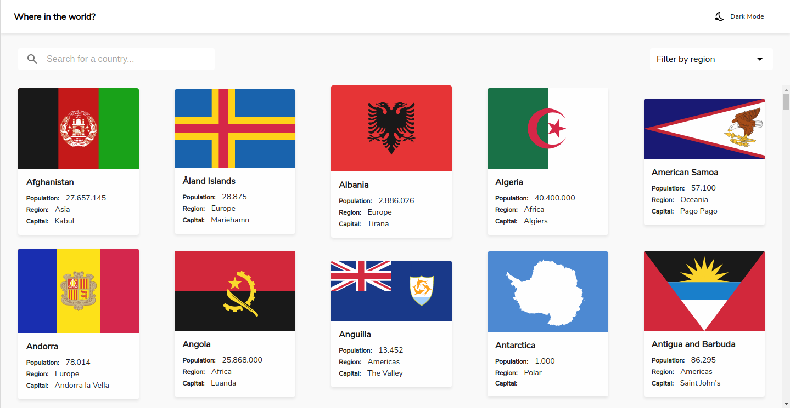
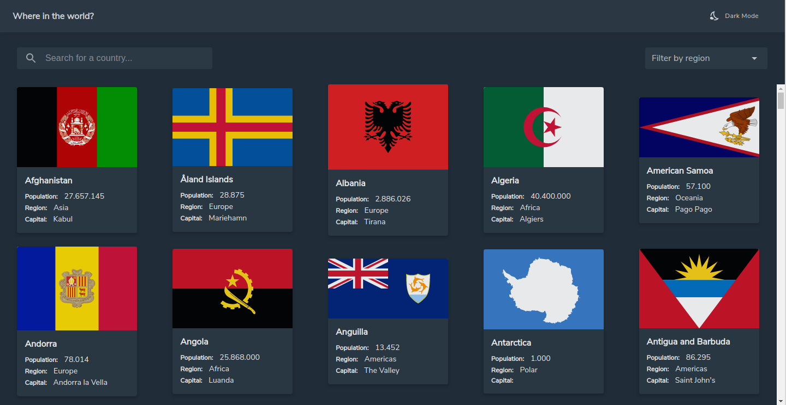
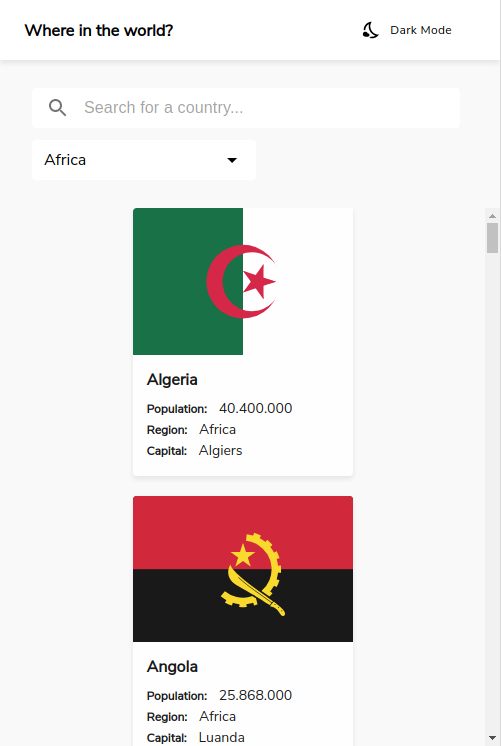
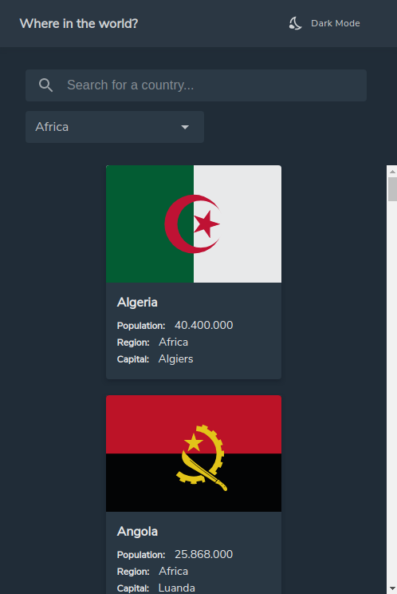
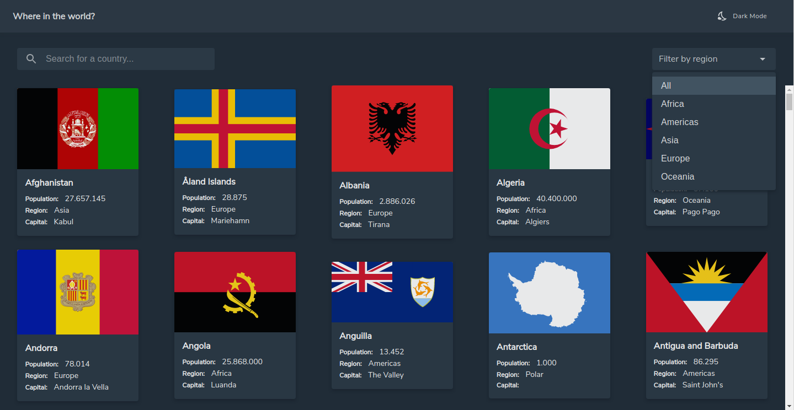
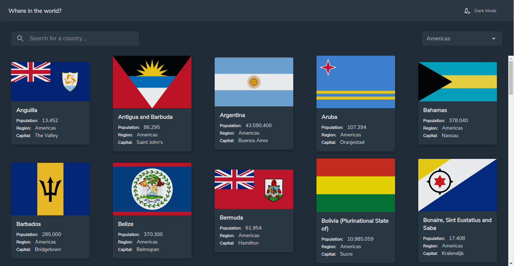
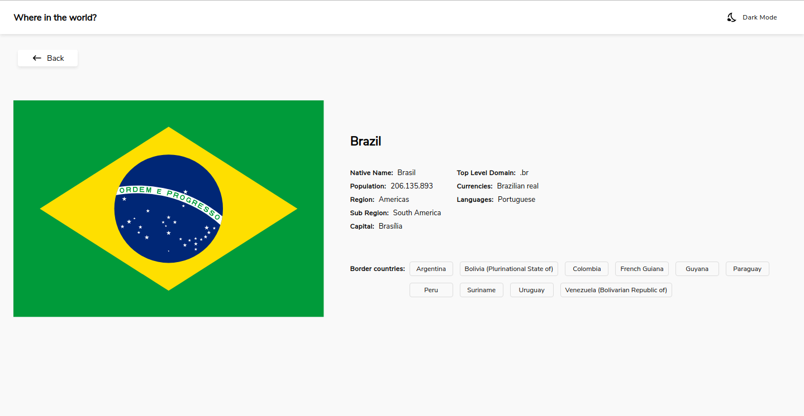
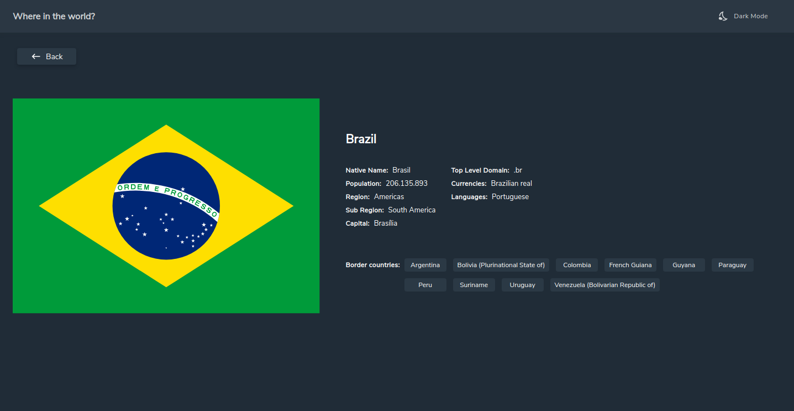
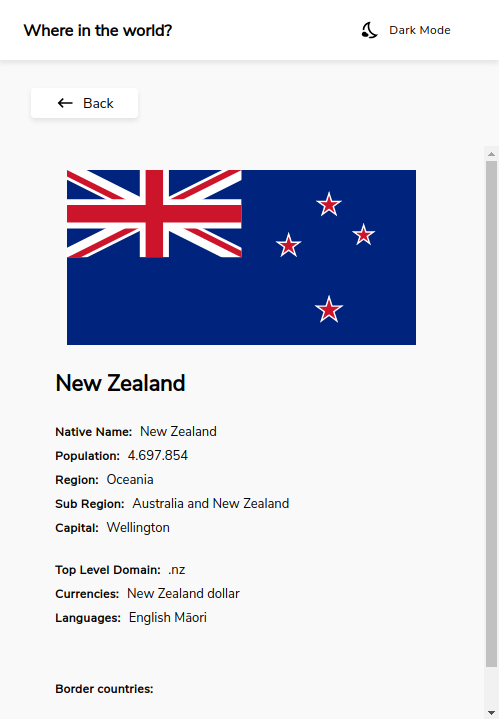
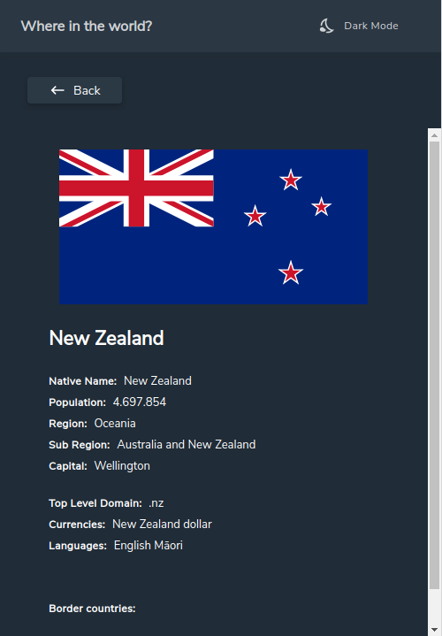

## REST Countries API with color theme switcher

### Created by `Arthur Regatieri Munhoz`
 

## Description
This webpage displays a country list from the result of an API, where the users can view each country details. Searching and filtering the list by region features are also available.
Made in React using typescript I created the solution both for desktop and mobile devices.

 
### The challenge

Users should be able to:

- See all countries from the API on the homepage
- Search for a country using an `input` field
- Filter countries by region
- Click on a country to see more detailed information on a separate page
- Click through to the border countries on the detail page
- Toggle the color scheme between light and dark mode *(optional)*
 

### Access the live website at: https://countries-arm.netlify.app
 

# Tech Stack
- React
- Typescript
- HTML
- CSS
- Bootstrap
 

# Screenshots

